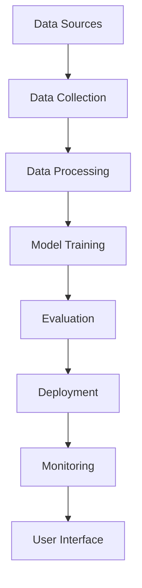

# 🚗 EV Charging LLM Pipeline

[](https://github.com/EsraaKamel11/EV-Charging-Task/actions)
[](https://www.python.org/downloads/)
[](LICENSE)
[](https://ev-charging-llm.streamlit.app)

> **Advanced Machine Learning Pipeline for Electric Vehicle Charging Infrastructure Analysis and Optimization**

## 📋 Table of Contents

- [🚀 Overview](#-overview)
- [✨ Features](#-features)
- [🏗️ Architecture](#️-architecture)
- [📦 Installation](#-installation)
- [🚀 Quick Start](#-quick-start)
- [📊 Usage](#-usage)
- [🔧 Configuration](#-configuration)
- [🧪 Testing](#-testing)
- [📈 Monitoring](#-monitoring)
- [🚀 Deployment](#-deployment)
- [📚 Documentation](#-documentation)
- [🤝 Contributing](#-contributing)
- [📄 License](#-license)

## 🚀 Overview

The EV Charging LLM Pipeline is a comprehensive machine learning system designed to analyze, optimize, and provide intelligent insights for electric vehicle charging infrastructure. This project combines advanced NLP, web scraping, data processing, and machine learning to deliver actionable intelligence for EV charging networks.

### 🎯 Key Objectives

- **Data Collection**: Automated gathering of EV charging data from multiple sources
- **Intelligent Analysis**: Advanced NLP and ML techniques for data processing
- **Optimization Insights**: AI-powered recommendations for charging infrastructure
- **Real-time Monitoring**: Live dashboard and monitoring capabilities
- **Scalable Architecture**: Production-ready, cloud-deployable system

## ✨ Features

### 🔍 **Data Collection & Processing**
- **Multi-source Data Gathering**: Web scraping, PDF processing, API integration
- **Intelligent Text Extraction**: Advanced NLP for document processing
- **Data Quality Assurance**: Automated validation and cleaning
- **Real-time Updates**: Continuous data pipeline with monitoring

### 🤖 **Machine Learning & AI**
- **Fine-tuned LLMs**: Custom-trained models for EV domain expertise
- **Q&A Generation**: Automated question-answer pair creation
- **Semantic Search**: Vector-based document retrieval
- **Performance Optimization**: Quantized models for efficiency

### 📊 **Analytics & Visualization**
- **Interactive Dashboards**: Streamlit-based user interface
- **Real-time Metrics**: Live performance monitoring
- **Custom Reports**: Automated report generation
- **Data Export**: Multiple format support (JSON, CSV, Parquet)

### 🛠️ **Development & Operations**
- **CI/CD Pipeline**: Automated testing and deployment
- **Docker Support**: Containerized deployment
- **Monitoring**: Prometheus/Grafana integration
- **Error Handling**: Robust error management and recovery

## 🏗️ Architecture

```
EV-Charging-Task/
├── 📁 ml_pipeline/                 # Main application directory
│   ├── 📁 src/                     # Source code
│   │   ├── 📁 data_collection/     # Data gathering modules
│   │   ├── 📁 data_processing/     # Data processing pipeline
│   │   ├── 📁 training_lora/       # LoRA fine-tuning
│   │   ├── 📁 training_qlora/      # QLoRA training
│   │   ├── 📁 evaluation/          # Model evaluation
│   │   ├── 📁 deployment/          # Deployment modules
│   │   └── 📁 utils/               # Utility functions
│   ├── 📁 config/                  # Configuration files
│   ├── 📁 data/                    # Data storage
│   ├── 📁 models/                  # Model storage
│   ├── 📁 outputs/                 # Pipeline outputs
│   ├── 📁 tests/                   # Test suite
│   └── 📁 docs/                    # Documentation
├── 📁 .github/                     # GitHub Actions workflows
├── 📁 docker/                      # Docker configurations
└── 📄 README.md                    # This file
```

### 🔄 **Pipeline Flow**



## 📦 Installation

### Prerequisites

- **Python**: 3.9 or higher
- **Git**: Latest version
- **Docker**: (Optional, for containerized deployment)
- **GPU**: (Optional, for accelerated training)

### Quick Installation

```bash
# Clone the repository
git clone https://github.com/EsraaKamel11/EV-Charging-Task.git
cd EV-Charging-Task/ml_pipeline

# Create virtual environment
python -m venv ev-charging-env
source ev-charging-env/bin/activate  # Linux/Mac
# or
ev-charging-env\Scripts\activate     # Windows

# Install dependencies
pip install -r requirements.txt
```

## 🚀 Quick Start

### 1. **Basic Pipeline Execution**

```bash
# Navigate to project directory
cd ml_pipeline

# Run the complete pipeline
python main.py

# Or run specific components
python -m src.data_collection.web_scraper
python -m src.data_processing.qa_generation
```

### 2. **Launch Streamlit Dashboard**

```bash
# Start the web interface
streamlit run streamlit_app.py

# Or use the launcher script
python run_streamlit.py
```

### 3. **Run Training Pipeline**

```bash
# QLoRA fine-tuning
python -m src.training_qlora.main_orchestrator

# LoRA training
python -m src.training_lora.lora_trainer
```

### 4. **Execute Evaluation**

```bash
# Run comprehensive evaluation
python run_evaluation.py

# Or specific evaluation components
python -m src.evaluation.benchmark_creator
```

## 📊 Usage

### 🔧 **Configuration**

Create a `.env` file in the `ml_pipeline` directory:

```env
# API Keys
OPENAI_API_KEY=your_openai_api_key
WANDB_API_KEY=your_wandb_api_key
HUGGINGFACE_TOKEN=your_hf_token

# Pipeline Settings
PIPELINE_ENV=development
LOG_LEVEL=INFO
MODEL_CACHE_DIR=./models/cache

# Deployment
STREAMLIT_APP_URL=your_streamlit_url
ML_API_URL=your_api_url
```

### 📈 **Data Collection**

```python
from src.data_collection.web_scraper import WebScraper
from src.data_collection.pdf_extractor import PDFExtractor

# Web scraping
scraper = WebScraper()
data = scraper.scrape_websites(['https://example.com'])

# PDF processing
extractor = PDFExtractor()
documents = extractor.extract_from_directory('./data/raw/')
```

### 🤖 **Model Training**

```python
from src.training_qlora.main_orchestrator import QLoRATrainer

# Initialize trainer
trainer = QLoRATrainer(
    model_name="meta-llama/Llama-2-7b-hf",
    dataset_path="./data/processed/qa_dataset.jsonl",
    output_dir="./models/fine_tuned/"
)

# Start training
trainer.train()
```

### 📊 **Evaluation**

```python
from src.evaluation.evaluation_engine import EvaluationEngine

# Run evaluation
evaluator = EvaluationEngine()
results = evaluator.evaluate_model(
    model_path="./models/fine_tuned/",
    test_data="./data/test/"
)
```

## 🔧 Configuration

### 📁 **Configuration Files**

- `config/config.yaml`: Main configuration
- `config/pipeline_config.yaml`: Pipeline-specific settings
- `config/settings.py`: Environment settings

### ⚙️ **Key Configuration Options**

```yaml
# Pipeline Configuration
pipeline:
  environment: development
  batch_size: 32
  max_length: 512
  learning_rate: 2e-5

# Model Configuration
model:
  base_model: "meta-llama/Llama-2-7b-hf"
  quantization: "4bit"
  lora_rank: 16
  lora_alpha: 32

# Data Configuration
data:
  input_dir: "./data/raw/"
  output_dir: "./data/processed/"
  cache_dir: "./cache/"
```

## 🧪 Testing

### **Run All Tests**

```bash
# Complete test suite
pytest tests/ -v

# Specific test categories
pytest tests/unit/ -v
pytest tests/integration/ -v
pytest tests/performance/ -v
```

### **Test Coverage**

```bash
# Generate coverage report
pytest --cov=src --cov-report=html
open htmlcov/index.html
```

### **Individual Test Files**

```bash
# Test specific components
python test_basic_functionality.py
python test_web_scraping_integration.py
python test_qlora_training.py
```

## 📈 Monitoring

### **Application Monitoring**

```bash
# Start monitoring stack
docker-compose -f docker-compose.monitoring.yml up -d

# Access monitoring dashboards
# Grafana: http://localhost:3000
# Prometheus: http://localhost:9090
```

### **Performance Metrics**

- **Model Performance**: Training loss, validation metrics
- **System Metrics**: CPU, memory, GPU utilization
- **Pipeline Metrics**: Processing time, throughput
- **Error Rates**: Failure tracking and alerting

### **Logging**

```python
import logging
from src.utils.config_manager import ConfigManager

# Configure logging
config = ConfigManager()
logger = config.get_logger()

logger.info("Pipeline started")
logger.error("Error occurred", exc_info=True)
```

## 🚀 Deployment

### **Docker Deployment**

```bash
# Build and run with Docker
docker build -f Dockerfile -t ev-charging-pipeline .
docker run -p 8501:8501 ev-charging-pipeline

# Docker Compose
docker-compose up -d
```

### **Cloud Deployment**

#### **Streamlit Cloud**
```bash
# Deploy to Streamlit Cloud
streamlit deploy streamlit_app.py
```

#### **Railway**
```bash
# Deploy to Railway
railway login
railway init
railway up
```

#### **GitHub Actions**
The project includes automated CI/CD through GitHub Actions:
- **Automated Testing**: Runs on every push
- **Model Training**: Scheduled training jobs
- **Deployment**: Automatic deployment to cloud platforms

### **Production Checklist**

- [ ] Environment variables configured
- [ ] Database connections tested
- [ ] Monitoring stack deployed
- [ ] SSL certificates installed
- [ ] Backup strategy implemented
- [ ] Performance testing completed

## 📚 Documentation

### **Project Documentation**

- [📖 **Project Structure**](ml_pipeline/PROJECT_STRUCTURE.md)
- [🔧 **Configuration Guide**](ml_pipeline/CONFIGURATION_MANAGEMENT.md)
- [📦 **Requirements Guide**](ml_pipeline/REQUIREMENTS_GUIDE.md)
- [🚀 **GitHub Actions Setup**](ml_pipeline/GITHUB_ACTIONS_SETUP.md)
- [📊 **Monitoring Guide**](ml_pipeline/README_MONITORING.md)
- [🌐 **Streamlit App Guide**](ml_pipeline/README_STREAMLIT.md)

### **API Documentation**

- **REST API**: Available at `/docs` when running the FastAPI server
- **Streamlit App**: Interactive documentation in the web interface
- **Code Documentation**: Comprehensive docstrings and type hints

### **Tutorials**

- [🎯 **Getting Started**](ml_pipeline/PIPELINE_RUNNING_GUIDE.md)
- [🤖 **Model Training**](ml_pipeline/QLORA_INTEGRATION_SUMMARY.md)
- [📊 **Evaluation**](ml_pipeline/EVALUATION_METRICS.md)
- [🔧 **Troubleshooting**](ml_pipeline/ERROR_HANDLING_ENHANCEMENTS.md)

## 🤝 Contributing

We welcome contributions! Please see our [Contributing Guidelines](CONTRIBUTING.md) for details.

### **Development Setup**

```bash
# Fork and clone the repository
git clone https://github.com/your-username/EV-Charging-Task.git
cd EV-Charging-Task

# Create feature branch
git checkout -b feature/your-feature-name

# Install development dependencies
pip install -r requirements_complete.txt
pip install -r requirements_monitoring.txt

# Run pre-commit hooks
pre-commit install
pre-commit run --all-files
```

### **Code Style**

- **Python**: Follow PEP 8 guidelines
- **Documentation**: Use Google-style docstrings
- **Testing**: Maintain >90% code coverage
- **Type Hints**: Use type annotations throughout

### **Pull Request Process**

1. Fork the repository
2. Create a feature branch
3. Make your changes
4. Add tests for new functionality
5. Ensure all tests pass
6. Update documentation
7. Submit a pull request

## 📄 License

This project is licensed under the MIT License - see the [LICENSE](LICENSE) file for details.

## 🙏 Acknowledgments

- **Hugging Face**: For the transformers library and model hosting
- **Streamlit**: For the web application framework
- **PyTorch**: For the deep learning framework
- **OpenAI**: For API access and model inspiration

## 📞 Support

### **Getting Help**

- **Issues**: [GitHub Issues](https://github.com/EsraaKamel11/EV-Charging-Task/issues)
- **Discussions**: [GitHub Discussions](https://github.com/EsraaKamel11/EV-Charging-Task/discussions)
- **Documentation**: [Project Wiki](https://github.com/EsraaKamel11/EV-Charging-Task/wiki)

### **Community**

- **Discord**: Join our community server
- **Email**: Contact the maintainers
- **Blog**: Read our latest updates

---

<div align="center">

**Made with ❤️**

[](https://github.com/EsraaKamel11/EV-Charging-Task/stargazers)
[](https://github.com/EsraaKamel11/EV-Charging-Task/network/members)
[](https://github.com/EsraaKamel11/EV-Charging-Task/issues)

</div> 
